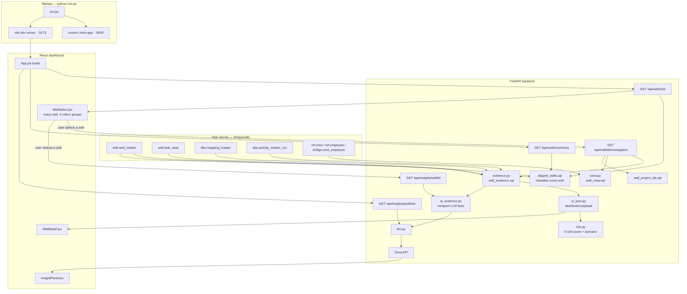

# Well Delay AI (Al-Tasnim)

Well-slippage monitoring and risk scoring for drilling operations. The backend
classifies **every well on record** (not just slipped ones), produces a
deterministic SQL "evidence layer" for a single well's task-level schedule
status — including its crew, supervisor and employee roster — and turns that
evidence into a per-well risk assessment: a 0–100 risk score, expected delay
in days, and the lagging WBS branches. The frontend is a React dashboard for
browsing the full well list (colour-coded by state), inspecting one well's
risk detail, and reading an AI-narrated summary of the same evidence.

## How it runs



`python run.py` starts both processes (top); everything else happens per
request while they run. The evidence path and the AI-narration path are
fetched **independently** (`get_evidence_bundle` and `summarize_well`), so a
slow or unavailable model never blocks the numbers.

## Project structure

```
.
├── backend/                   FastAPI service
│   ├── .env                   Database + Groq credentials (not committed)
│   ├── main.py                FastAPI app entrypoint (+ CORS for the React dev server)
│   ├── requirements.txt       Backend dependencies
│   ├── script.py              Standalone SQL Server schema/data inventory tool
│   ├── database_inventory.txt Output of script.py (not committed)
│   ├── app/
│   │   ├── api/
│   │   │   ├── wells.py           /api/wells/summary, /api/wells/list, /api/slipped-wells
│   │   │   ├── investigation.py   /api/well/{id}/investigation
│   │   │   └── insights.py        /api/insights/portfolio, /api/insights/well/{id}
│   │   ├── database/          DB connection helper (+ datetimeoffset decoder)
│   │   ├── services/
│   │   │   ├── evidence.py        runs well_evidence.sql, returns raw evidence
│   │   │   ├── crew.py            runs well_crew.sql, groups crew/supervisor/employee rows
│   │   │   ├── milestones.py      which SQL column describes which gate
│   │   │   ├── ui_json.py         raw evidence -> dashboard JSON
│   │   │   ├── ai_evidence.py     raw evidence -> compact LLM evidence
│   │   │   ├── risk.py            composite risk score + scenario (no date arithmetic)
│   │   │   ├── attribution.py     due / non-due mapping
│   │   │   ├── slipped_wells.py   fleet-wide classification + picker categories
│   │   │   ├── summary.py         headline counts
│   │   │   ├── serialization.py   JSON-safety formatting helpers
│   │   │   ├── investigation.py   pipeline orchestration + debug persistence
│   │   │   └── llm.py             Groq narration
│   │   └── responses/         investigation.json + evidence_raw/ai (not committed)
│   └── sql/
│       ├── well_evidence.sql      AUTHORITATIVE evidence layer (single source of truth)
│       ├── well_crew.sql          crew / supervisor / employee roster for one well
│       ├── slipped_wells.sql      classifies EVERY well (completed / due / non-due / on-track)
│       ├── well_summary.sql       headline counts
│       └── well_project_ids.sql   all project IDs for a well
│
├── run.py                     Dev runner: starts backend + frontend together
│
├── frontend/                   React dashboard (Vite)
│   ├── package.json
│   ├── vite.config.js
│   ├── index.html
│   ├── .env.example            VITE_API_URL
│   └── src/
│       ├── App.jsx             Page orchestration + data loading
│       ├── api.js              Backend fetch wrappers
│       ├── components/         SummaryCards, WellSelect, WellDetail, InsightPanel
│       └── styles.css
│
├── business_rules.md          Authoritative business definitions (read before touching SQL)
└── .gitignore
```

## Prerequisites

- Python 3.11+
- Node.js 18+ (for the React frontend)
- Microsoft ODBC Driver 17 or 18 for SQL Server (used by `pyodbc`)
- Network access to the SQL Server instance holding the `AlTasnimBI` database
- A Groq API key (for AI summaries — the rest of the dashboard works without one)

## Setup

1. Create and activate a virtual environment at the project root:

   ```bash
   python -m venv .venv
   .venv\Scripts\activate      # Windows
   source .venv/bin/activate   # macOS/Linux
   ```

2. Install backend dependencies:

   ```bash
   pip install -r backend/requirements.txt
   ```

3. Install frontend dependencies:

   ```bash
   cd frontend
   npm install
   ```

4. Configure the backend in `backend/.env` (or the project-root `.env` — either
   is read):

   ```
   DB_SERVER=your-server-host
   DB_PORT=1433
   DB_NAME=AlTasnimBI
   DB_USER=your-username
   DB_PASSWORD=your-password
   DB_DRIVER=ODBC Driver 18 for SQL Server
   DB_TRUST_SERVER_CERTIFICATE=yes

   api_key=your-groq-api-key
   GROQ_MODEL=openai/gpt-oss-120b
   ```

## Running

**Both at once (recommended for local dev):**

```bash
python run.py
```

Starts the backend and frontend together, prefixes their logs (`[backend]` /
`[frontend]`), and stops both on Ctrl+C or if either one exits. Override the
backend bind address with `BACKEND_HOST` / `BACKEND_PORT`.

**Backend (FastAPI) on its own:**

```bash
cd backend
uvicorn main:app --reload
```

Runs on `http://127.0.0.1:8000` by default. Key endpoints:

- `GET /api/wells/summary` — well counts: total, live, completed, slipped
  (due), slipped (non-due), not slipped
- `GET /api/wells/list` — **every** well on record, ascending by ID, each
  tagged with a picker category (`AL_TASNIM`, `PDO`, `ON_TRACK`, `COMPLETED`)
- `GET /api/slipped-wells` — slipped wells only, with `delay_days` and
  `slip_reasons`
- `GET /api/well/{well_id}/investigation` — full risk assessment for one well
  (scenario, due status, risk score, expected delay, lagging WBS branches,
  delayed activities, crew/supervisor/employee roster, project IDs); also
  written to `backend/app/responses/investigation.json`
- `GET /api/insights/portfolio` — AI summary of the portfolio counts
- `GET /api/insights/well/{well_id}` — AI summary of one well's assessment

A **completed** well returns exactly the same shape as any other — it is no
longer excluded from `/investigation`, so it can be opened from the picker
like any live well.

**Frontend (React dashboard):**

```bash
cd frontend
npm run dev
```

Opens on `http://localhost:5173`. If the backend is not running on
`http://127.0.0.1:8000`, copy `.env.example` to `.env` and set `VITE_API_URL`.

The backend allows the Vite dev-server origin via CORS. If the frontend is
served from a different origin, set `CORS_ALLOWED_ORIGINS` (comma-separated)
in `backend/.env`.

## Architecture: who is allowed to calculate what

```
DATABASE
  └─ backend/sql/well_evidence.sql      AUTHORITATIVE DETERMINISTIC EVIDENCE
       │                                 all milestone, delay, DQ, activity,
       │                                 WBS, quantity, productivity and
       │                                 classification logic lives HERE
       ├─ raw_evidence                   untouched SQL output, 2 result sets
       │    ├─ build_ui_json()           -> dashboard payload
       │    │     + crew.py/well_crew.sql -> crew/supervisor/employee roster
       │    └─ build_ai_evidence()       -> compact facts for the model
       │                                    (crew roster deliberately excluded —
       │                                     see "AI summaries" below)
       └─ LLM  ->  narrated paragraph    EXPLANATION ONLY
```

**SQL calculates. Python structures. The LLM explains.** These
responsibilities are never reversed.

`well_evidence.sql` carries the approved evidence-layer CTEs so no business
rule can drift. It returns two result sets — one well-level row (present for
every well, completed or not) and one row per current logical task with the
full evidence projection. The delayed-activity filter is applied downstream
so a single query serves both the full evidence view and the delayed view.

The only deliberate Python-side calculations, both documented in place:

| Value | Why not SQL |
|---|---|
| `risk.risk_score` | the SQL produces `ai_schedule_classification` and the two evidence levels, but no 0–100 composite |
| `risk.due_status` | due/non-due attribution from `kpi_miss_reason` ([attribution.py](backend/app/services/attribution.py)) |

Everything else the dashboard and the summary show — every date, delay,
variance, status, flag, crew id, supervisor name and employee name — is read
straight out of the SQL result. `risk.expected_delay_days` is not derived
either: it is the SQL's own delay column for whichever gate the scenario
measures (`construction_lag_days` before drilling, `hookup_delay_days` after),
so the figure on screen is the figure the SQL computed.

### What the model may not do

The prompt forbids, explicitly: calculating dates, day differences,
percentages or risk scores; deciding due/non-due or a milestone status;
inventing missing values; inferring a delay that is not present as a
`delay_days` above zero; inferring causality from remarks; inferring a
resource shortage from the existence of resource data; treating an
activity's delay as the well's delay; reinterpreting
`AHEAD_OF_SCHEDULE` as overdue; or contradicting the supplied attribution.

Accountability is handled with particular care. The model was observed
**inverting** the enum — reading `NON_DUE` and writing "attributed to
Tasnim's responsibility". So the AI evidence no longer asks it to
interpret: `accountability.statement` is a ready-made sentence built in
Python from the authoritative verdict, and the prompt instructs the
model to reproduce its meaning rather than re-derive it.

### Well delay is not activity delay

These are separate measurements and the summary must keep them apart.
The AI evidence names the gate the well-level figure belongs to
(`risk.expected_delay_gate`) so the distinction is unambiguous:

> the hook-up milestone is 366 days overdue, while the most delayed
> activity is FLC1380 at 392 days

## Well categories (the picker)

`GET /api/wells/list` returns **every** well, not just slipped ones, each
tagged with exactly one category — completion wins over everything else:

| Category | Meaning | Colour |
|---|---|---|
| `COMPLETED` | Hook-up recorded (`eng_completion_date IS NOT NULL`) | grey |
| `AL_TASNIM` | Live, slipped, classified **DUE** — Tasnim owns the delay | red |
| `PDO` | Live, slipped, classified **NON-DUE** — FLAF/SCR/PDO-side cause | amber |
| `ON_TRACK` | Live, no milestone has slipped | green |

`WellSelect.jsx` lists all of them in one flat, ascending-by-`well_id` run —
colour carries the category rather than grouping breaking the ordering — with
a small counted legend underneath.

Selecting a **completed** or **on-track** well shows the same detail panel as
any other, but tuned so it never implies a problem that isn't there:

- No risk score is shown (`risk_score` is `None` for both states, the same
  as a well still drilling)
- The accountability badge reads `COMPLETED` / `ON TRACK` instead of
  DUE/NON-DUE — `risk.due_status` (derived from `kpi_miss_reason`) defaults
  to `DUE` whenever no reason is recorded, which used to leak through as a
  false "DUE" on wells that had never slipped at all
- The data-quality flags section and the "Classified DUE/NON-DUE" note are
  hidden for on-track wells
- "Delayed activities" is relabelled "Activities" for on-track wells, with no
  red "late" highlighting — the underlying rows are unchanged, only the
  framing is

The AI summary follows the same rule: it opens with *"the well is currently
proceeding on schedule"* for an on-track well, and for a completed well it
reports any historical delays factually but closes with a sentence such as
*"despite these delays, the well was completed overall"* rather than reading
as a live alarm.

## Slippage criteria

`slipped_wells.sql` classifies **every well on record** with two verdicts —
`is_completed` and `is_slipped` — so the picker and the slipped-well list
share one definition instead of two. A live well is flagged `is_slipped` if
**any** of the six tests below fires; each firing test is reported in the
well's `slip_reasons`, and `delay_days` is the **worst** lateness across all
of them. A hooked-up well is never `is_slipped`, whatever its milestones once
looked like.

| # | Reason code | Test | Meaning |
|---|---|---|---|
| 1 | `RIG_ON` | `rig_on_date > ex_rig_on_date`, or `rig_on_date IS NULL AND ex_rig_on_date < today` | Rig-on late, or overdue and still not recorded |
| 2 | `RIG_OFF` | `rig_off_date > ex_rig_off_date`, or `rig_off_date IS NULL AND ex_rig_off_date < today` | Rig-off late, or overdue and still not recorded |
| 3 | `HOOKUP` | `rig_off_date` present AND `today > rig_off_date + 2 days` | Hook-up (Tasnim scope completion) overdue after drilling |
| 4 | `CONSTRUCTION` | `today > ex_rig_on_date − 1 day AND rig_on_date IS NULL` | Construction not finished by its rig-on−1-day deadline |
| 5 | `PEGGING` | `pegged_date > ex_rig_on_date − 60 days`, or NULL past that deadline | Pegging gate missed or late |
| 6 | `FLAF` | `flaf_issue_date > ex_rig_on_date − 90 days`, or NULL past that deadline | FLAF gate missed or late |

Tests 5 and 6 are the **early-warning** signals: they fire 60 and 90 days
before rig-on, which is what makes the dashboard predictive rather than
purely retrospective.

### NULL handling

Source data is incomplete, so every test is anchored on a column that is
reliably populated:

- `ex_rig_on_date` and `ex_rig_off_date` are 100% populated and serve as the
  baselines.
- A test needing an ACTUAL date only fires when that date exists — e.g. hook-up
  requires `rig_off_date`, so a missing rig-off can never look like a slip.
- `const_complete_date` (34% populated), `scr_date` (43%) and
  `tie_in_ready_date` (68%) are deliberately **not** used as slip tests: a NULL
  there means "not recorded" far more often than "late". Construction therefore
  uses the NULL-safe rule above instead of `const_complete_date`.

### Due vs non-due (bonus potential)

`well_master.kpi_miss_reason` attributes the delay. Reasons outside Tasnim's
control mark the well **NON_DUE** — reported as bonus potential rather than
counted as Tasnim-side risk. Mapping lives in
[backend/app/services/attribution.py](backend/app/services/attribution.py).

| Classification | `kpi_miss_reason` values |
|---|---|
| **NON_DUE** (bonus potential) | anything containing `FLAF`; `SCR`; `Awaiting Manifold/MSV`; `Awaiting Handover`; `Well Suspended`; `NON KPI` / `Non KPI well` |
| **DUE** (Tasnim scope) | everything else, including `Scope Change`, `Material Availability`, `Non Standard`, and wells with no reason recorded |

Matching is case- and whitespace-insensitive, since the source values are
inconsistently entered (`FLAF Delayed`, `FLAF DELAY`, `FLAF`). Note that this
classification only means something once a well has actually slipped — see
"Well categories" above for how an on-track/completed well avoids it leaking
through as a false DUE.

### Data-quality flags

A flagged well also carries `has_data_issue`, raised when any of these hold:

- `dq_missing_baseline` — `ex_rig_on_date` or `ex_rig_off_date` is NULL, so a
  milestone cannot be evaluated at all.
- `dq_rig_off_before_rig_on` — rig-off recorded before rig-on.

## Risk model

Each selected well is classified from `rig_on_date` / `rig_off_date` /
`eng_completion_date` and scored accordingly:

| Scenario | Condition | Deadline | Risk score |
|---|---|---|---|
| Before drilling | no rig-on yet | `ex_rig_on_date − 1 day` — construction must finish the day before rig-on | scored once overdue |
| After drilling | rig-off recorded, hook-up incomplete | `rig_off_date + 2 days` | scored once overdue |
| Drilling in progress | rig-on done, no rig-off | Not scored — outside the current scope | none |
| Completed | eng. completion recorded | — | none |

A well that has **not yet** missed its own scenario deadline shows **no risk
score at all** — the same `None` a completed or still-drilling well shows —
rather than an anticipatory figure. An earlier version scored these wells
with a capped 0–40 "anticipatory" number, but that read as risk where none
had actually materialised yet, so it was removed: due and not-yet-due should
never look like variations of the same thing.

### Score composition (once a well is actually overdue)

`risk_score` is a weighted blend of three normalised components, so no single
input can pin it at 100:

| Component | Weight | Basis |
|---|---|---|
| Lateness | 0.55 | Days past the deadline, via `days / (days + 90)` |
| Breadth | 0.25 | How many of the four milestones have slipped |
| Activity | 0.20 | Delayed-activity count and worst activity delay |

Lateness uses a **saturating curve rather than a linear ramp**. The original
linear version (`60 + days × 2`) hit its ceiling at ~20 days overdue, which put
**31% of wells at exactly 100** and left the score unable to distinguish a
30-day slip from a 300-day one. The curve reaches 0.5 at 90 days and keeps
rising without ever reaching 1, so ordering is preserved at any magnitude.

When a well has no activity rows, the activity weight is **redistributed** over
the other two rather than scored as zero — missing evidence should not read as
an absence of risk.

Thresholds are named constants at the top of
[backend/app/services/risk.py](backend/app/services/risk.py) — tune them once
real outcomes are available to validate against.

## Crew, supervisor & employee roster

[`well_crew.sql`](backend/sql/well_crew.sql) resolves the people behind a
well's work:

```
well_id
  -> well.task_daily.crew_id        crews that worked the well
     -> ref.crew.code               crew code
     -> ref.crew.supervisor_id      the crew's supervisor
        -> ref.employee.emp_name    supervisor name
     -> bridge.crew_employee        crew membership
        -> ref.employee             employee id + name
```

[`crew.py`](backend/app/services/crew.py) groups the flat crew × employee
rows into one entry per crew and de-duplicates (a well's tasks repeat the
same crew hundreds of times). A crew with no resolved code, supervisor or
employees keeps its `None`s — the dashboard says "not recorded", never a
guess. Shown in the well-detail panel as **Crews, supervisors & employees
(`N`)**. Deliberately **excluded** from the AI evidence: a full roster would
add hundreds of tokens to every narration request against an account-level
Groq rate limit (see "AI summaries" below).

## Activity / WBS mapping

Business rule: `task_code -> activity_id -> activity_code -> WBS`, documented
in full in [business_rules.md](business_rules.md) §3. The activity_id →
activity_code hop currently resolves through **`dbo.mapping_master`**
(`New_Activity_Code`), not the older `dbo.activity_master_mapping` table —
the old table was found to resolve only a minority of activity_ids actually
seen in `task_daily` (~30% overall, 0% for some wells entirely), while
`mapping_master` resolves substantially more (~46% overall). Making this the
source of truth took one real well's WBS-branch count from 0 to 23.

`mapping_master` has no equivalent of the old table's `project_type`,
`composition_code` or `class_b_ptw` columns; those are reported as not
recorded rather than backfilled from the superseded table.

## AI summaries

The dashboard narrates its own output through Groq. The model **computes
nothing**: the already-computed JSON is handed to it and it only explains what
is there, so the prose and the dashboard can never disagree. Every count,
percentage and day-count — including combined figures like "due + non-due" —
is calculated in Python and passed in; the prompt explicitly forbids the model
from deriving, adding or otherwise computing a number itself. Output is
low-temperature (`0.2`) plain prose — **not** Groq's JSON response mode: a
reply that hits `max_tokens` under JSON mode is rejected outright with
`400 json_validate_failed`, losing the whole summary, whereas plain prose
just degrades to a shorter paragraph.

| Endpoint | Narrates |
|---|---|
| `GET /api/insights/portfolio` | Well counts and the due/non-due split, every recorded non-due cause, ranked |
| `GET /api/insights/well/{well_id}` | The well's stage; every slipped gate with its expected date, actual date and exact days late; accountability and `kpi_miss_reason`; `remarks`; the driving activity or WBS branch; the data-quality caveat if flagged; tone adapted for a completed or on-track well (see "Well categories" above) |

Both are fetched separately from the figures they describe, so a slow or
unavailable model never blocks the dashboard.

### Token budget

The account's Groq key is capped at **8,000 tokens/minute**. The system
prompt is compacted (~1,300 tokens, down from an earlier ~2,900-token version
that alone left little headroom), the evidence JSON is sent with no
indentation whitespace, and `max_tokens` is sized to what a summary actually
uses (900 for a well, 700 for the portfolio) rather than a much larger
round number. A single well narration now costs roughly 2,000–4,000 total
tokens depending on how much evidence the well carries.

### Expected vs. actual dates

Every gate (rig-on, rig-off, pegging, FLAF, hook-up) carries its expected
date, its actual date (or "not yet recorded"), and the exact number of days
late — computed once in
[`risk.py`](backend/app/services/risk.py) as `milestone_delays` and reused by
both the UI's Key Dates panel and the AI prompt, so the two can never disagree
on a day count. A gate only shows a "days late" chip when `delay_days > 0`.

### Project IDs

`well_master` carries one `project_id` per well, but `task_daily` rows for the
same well frequently reference a **different** one — separate scopes of work
(Flowline vs. Location, for example) are tracked as separate projects against
the same physical well. Most wells have exactly one project_id; some have two
or more.
[`well_project_ids.sql`](backend/sql/well_project_ids.sql) returns the union
of every `project_id` seen for the well across both tables, resolved to
`project_code` / `project_name` via `project.project_mstr` where a match
exists — a `project_id` with no match still returns its own row (fields
`null`) rather than being dropped. Shown in the well-detail panel as
**Projects (`N`)**, right above the crew roster.

### Highlighted database terms

Beyond the numeric highlighting (dates green, percentages blue, other numbers
red), the AI paragraph highlights **verbatim database content** — a recorded
`kpi_miss_reason`, an activity name/code, a WBS branch, a project code/name,
the `remarks` text — in purple italic, distinct from the numeric colours. The
term list is never fixed: [`ai_evidence.py`](backend/app/services/ai_evidence.py)'s
`highlight_terms()` builds it fresh from whatever the current response's JSON
actually contains, and the API returns it as `highlight_terms` alongside
`summary`. Raw status enums (`due_status`, `scenario`, milestone statuses) are
deliberately excluded — once the model translates them into prose ("due",
"missed"), they're ordinary English words, and highlighting every occurrence
would colour normal sentence structure rather than actual database content.

Configuration in `.env`:

```
api_key=<your Groq API key>
GROQ_MODEL=openai/gpt-oss-120b
```

`GROQ_MODEL` is optional — falls back to `openai/gpt-oss-120b` if unset.
Changing models later is just editing `.env`; nothing in `llm.py` needs to
change. Note that **`llama-3.3-70b-versatile` is not available on the current
Groq account** — the key returns `model_not_found`, and the account exposes
no Llama chat model. Check what's available with:

```bash
curl -s https://api.groq.com/openai/v1/models -H "Authorization: Bearer $api_key"
```

Not yet implemented (needs schema confirmation first):

- `hoist_on_date` / `hoist_off_date` / `wellpad_handover_date` in the
  after-drilling due-date rule. The columns **do** exist but are ~1% and 0.1%
  populated respectively, and `well.wmr_conversion` (which also carries them,
  plus `expected_hoist_on_date`) is an empty table — so the rule uses
  `rig_off_date + 2 days` only.

**Database inventory tool (optional, backend-only):**

```bash
cd backend
python script.py
```

Connects to the database using the same `.env` credentials and writes a full
schema/sample-data dump to `backend/database_inventory.txt`. This file
contains real server/connection details and sample production data, so it is
git-ignored — do not commit it.

## Notes

- `backend/app/responses/investigation.json` is generated at runtime and is
  git-ignored.
- `backend/.env` and `backend/database_inventory.txt` contain sensitive
  connection details and are git-ignored.
- [business_rules.md](business_rules.md) is the authoritative source for
  business definitions (Location vs. Flowline Construction, milestone
  deadlines, schedule-variance direction, WBS resolution, etc.). If a query
  or a summary needs a rule not stated there, the answer is "not yet
  defined" — never an invented one.
